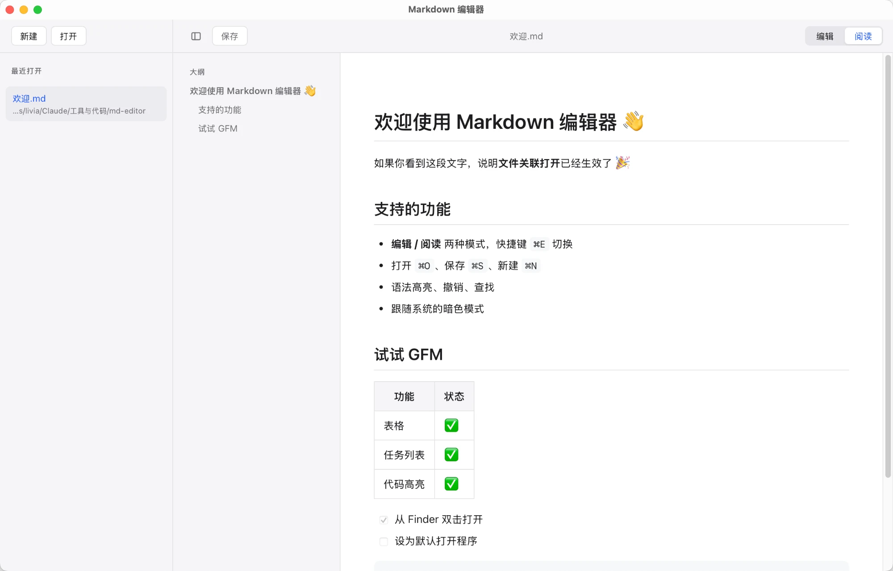
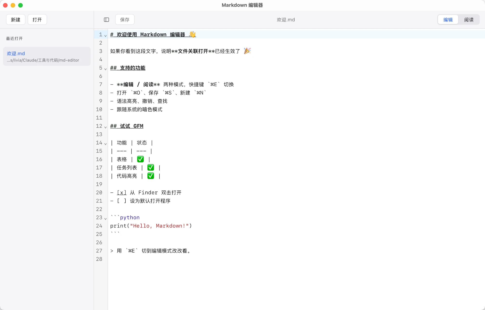

**English** | [简体中文](README.md)

# Markdown Editor

A clean, native macOS Markdown editor with separate reading and editing modes. Built with [Tauri 2](https://tauri.app/) + TypeScript — small footprint, fast startup.

**[⬇️ Download for macOS (Apple Silicon)](https://github.com/livoko/markdown-editor/releases/latest)**



<details>
<summary>Editing mode (syntax highlighting)</summary>



</details>

## Features

- **Reading / Editing** dual modes, toggle with `⌘E`; files open in reading mode by default
- **GFM rendering**: headings, lists, task lists, tables, code highlighting, blockquotes, and more
- **Syntax-highlighted editor** (CodeMirror 6) with undo and find
- **File sidebar**: New / Open + a recent-files list (remove entries individually, collapse with `⌘\`)
- **Outline in reading mode**: click a heading to jump, auto-highlights while scrolling
- **File association**: can be set as the default app for `.md` files, double-click to open from Finder
- **Export to HTML / PDF** (HTML is a self-contained styled file; PDF via system print)
- Follows the **system light/dark theme**
- Unsaved-changes prompt; the Save button lights up when there are unsaved changes

## Shortcuts

| Shortcut | Action |
| --- | --- |
| `⌘N` | New |
| `⌘O` | Open |
| `⌘S` | Save |
| `⌘E` | Toggle reading / editing |
| `⌘\` | Collapse / expand sidebar |

## Tech stack

- **Framework**: Tauri 2 (Rust shell + system WebView)
- **Frontend**: TypeScript + Vite (no framework)
- **Editor**: CodeMirror 6
- **Rendering**: markdown-it + highlight.js + markdown-it-task-lists

## Development

Prerequisites: [Node.js](https://nodejs.org/) and [Rust](https://www.rust-lang.org/tools/install).

```bash
npm install        # install dependencies
npm run tauri dev  # local development (compiles Rust + starts frontend)
npm run tauri build -- --bundles app  # build the .app
```

The build output is in `src-tauri/target/release/bundle/macos/`.

## License

MIT
